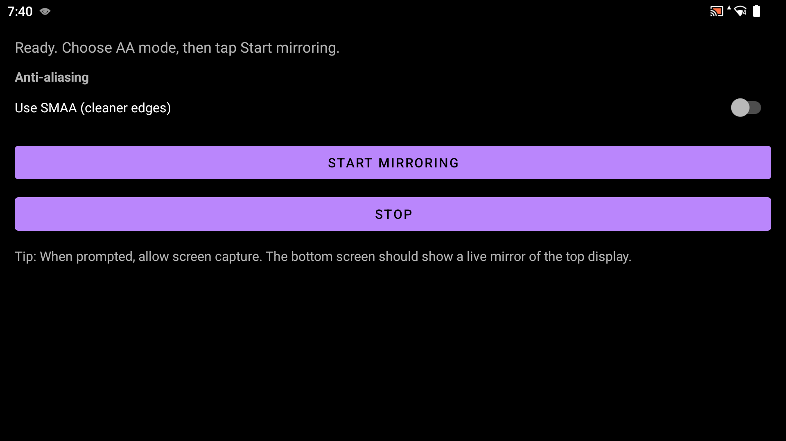
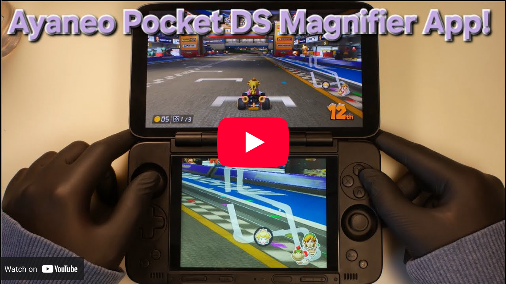

# Ayaneo Pocket DS Magnifier

# This build is out of date. You can access the most up to date versions and all my other tools through a single app! PDS Utilities: https://github.com/YesItsKira/PDS-Utilities
Ayaneo Pocket DS Magnifier is a small utility app made for the **AYANEO Pocket DS** (dual-screen Android handheld).

It **mirrors the top screen onto the bottom screen** and turns the bottom screen into a **live magnifier**. This is especially useful in games when you want to zoom in on small UI elements (like a minimap) while still playing normally on the main screen.

## Inspiration

This app is inspired by the **magnification trick on the AYN Thor**, where a second screen can be used as a live “zoomed view” of the main display. This project brings that same idea to the **AYANEO Pocket DS**.

## How to use

1. Open **Ayaneo pocket DS Magnifier**
2. Tap **Start mirroring**
3. When Android shows the screen capture prompt, tap **Start now**
4. The **bottom screen** will show a live view of the **top screen**
5. Use gestures on the **bottom screen**:
   - **Pinch** to zoom in/out
   - **Drag with one finger** to pan around
   - **Double tap** to reset zoom/pan
   - **3-finger tap** to show/hide the tuning overlay (AA + sharpness sliders)

> Note: Android always shows the “Start now” confirmation for screen capture. That’s normal.

## Features

### Live top-to-bottom mirroring
Uses Android’s screen capture (MediaProjection) to mirror the top display onto the bottom display in real time.

### Zoom and pan magnifier controls
The bottom screen acts like a magnifying glass:
- pinch to zoom!
- drag to pan
- reset with a double tap

### Fit at 1×, fill when zoomed
To avoid stretching:
- At **1× zoom** the image is **fit** to show the full view (may show small bars depending on aspect ratio)
- When **zoomed in**, the view **fills** the bottom screen (no black bars while magnifying)

### Anti-aliasing modes
The app includes two AA options:
- **FXAA** (default)
- **SMAA (Experimental)** — can look cleaner in some games, but may vary depending on the UI/minimap style

### 3-finger tuning overlay (AA + sharpness)
A **3-finger tap** on the bottom screen opens an overlay with two sliders for the **currently active AA mode**:
- **AA Strength** (how strong FXAA/SMAA is)
- **Sharpness** (how crisp the image is)

These sliders update live while mirroring, so you can tune it per-game.

## Permissions

- **Screen capture permission** (MediaProjection “Start now” prompt)
- **Notifications permission** (Android 13+) so the app can show the required foreground-service notification while capturing

## Tips for minimaps

- If the minimap looks **too jagged**: increase **AA Strength**
- If it looks **too soft**: increase **Sharpness**
- If it **shimmers** while moving: reduce **Sharpness** a bit

---
This project is not affiliated with AYANEO or AYN.

I dont charge for any of my projects and make them free for the communities they are in. If you like my stuff, id appreciate a tip!

https://ko-fi.com/yesitskira
